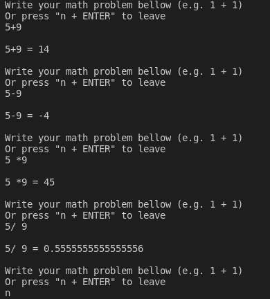

# Python Calculator
> A simple application that have the unique use to make math operations as fast as a the human brain!

Make quicky math operations

## Installation

1. Install the Visual Studio Code app from Microsoft;

2. Download the .zip file from the repository, clicking on "Code" and then on "Download zip";

3. Extract the file in the folder where it was installed and open Visual Studio Code;

4. With the application open, click on "File", then "Open Folder", and select the location where the zip file was downloaded;

5. Open the folder, click on "main.py" and then on the play button in the upper right corner.
## Utility

With the code available you can have the ability to do math operations like addition, subtraction, multiplication and division quickly and efficiently.
## Patch Notes

* 0.1.0 (08/02/2022)
    * Project launched
    * CHANGE: Readme file update
## Meta

Guilherme Bracero Gonzales - [@bracerin](https://twitter.com/bracerin) - guibragon@gmail.com

Distributed for free, provided credits are given
(https://github.com/BraceroInSabot)